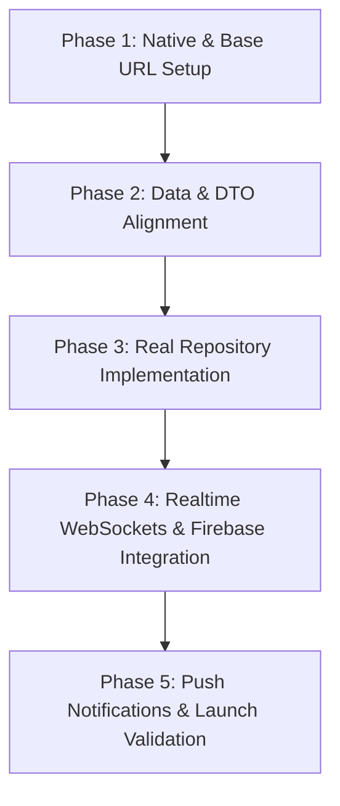

# ZeroPay Client Integration Plan: Bridging Flutter & Monorepo Backend

This document outlines the systematic migration plan to transition the **ZeroPay Flutter Client** from a self-contained mock sandbox into a fully integrated, live production client for the **ZeroPay Monorepo Backend Platform**.

---

## 📅 Integration Architecture Phases



---

## 🛠️ Step-by-Step Migration Guide

### Step 1: Regenerate Native Project Wrappers
Before compiling, the native build wrappers for iOS and Android must be created.
1. Navigate to the `/Users/maddy/ZeroPay-app` directory.
2. Run:
   ```bash
   flutter create --org network.zeropay --project-name zeropay_app .
   ```
3. Verify that the `android/` and `ios/` native folders are generated.

---

### Step 2: Resolve the Base URL Route Mismatch
Update the routing configuration in the Flutter client to point to the backend server's active namespace.
1. Open the [endpoints.dart](file:///Users/maddy/ZeroPay-app/lib/core/api/endpoints.dart) file.
2. Modify line 5 to include the `/api` segment:
   ```diff
   - static const String baseUrl = 'https://api.zeropay.network/v1';
   + static const String baseUrl = 'https://api.zeropay.network/api/v1';
   ```

---

### Step 3: Implement Denomination & DTO Converters
The backend enforces secure integer calculations for monetary units (`amountPaise` and `amountLovelace`). The client must convert user inputs (fiat doubles/ADA floats) to integers before dispatching payloads.
1. Implement serialization helpers to process double currency units:
   ```dart
   int toPaise(double fiat) => (fiat * 100).round();
   int toLovelace(double ada) => (ada * 1000000).round();
   
   double fromPaise(int paise) => paise / 100;
   double fromLovelace(int lovelace) => lovelace / 1000000;
   ```
2. Update the request mappings in `api_services.dart` to apply these conversions before sending transaction details to the backend.

---

### Step 4: Implement `RealZeroPayRepository`
Create a clean, production implementation of the `ZeroPayRepository` contract that makes network requests using the preconfigured `ApiServices`.
1. Create `lib/shared/data/real_repository.dart`.
2. Map the interface calls directly to their corresponding API services:
   *   `getCurrentUser()` ➡️ `AuthApiService.getCurrentUser()` (via `/api/v1/auth/me`)
   *   `getWalletAssets()` ➡️ `WalletApiService.fetchBalances()`
   *   `getEscrowContracts(role)` ➡️ `EscrowApiService.listContracts()` (mapped to `/api/v1/invoices/merchant/list` or `/api/v1/invoices/:invoiceId`)
   *   `releaseMilestone(escrowId, milestoneId)` ➡️ `EscrowApiService.triggerMilestoneRelease()`
   *   `raiseDispute(escrowId)` ➡️ `EscrowApiService.triggerEscrowDispute()`
   *   `getAIRecommendations()` ➡️ `AiApiService.getLuminaRecommendations()`
   *   `getNegotiationChat()` ➡️ `AiApiService.fetchRoomMessages()` (connected to Firebase RTDB node)

---

### Step 5: Switch Provider Binding
Switch the central Riverpod provider to instantiate `RealZeroPayRepository` once network configurations are validated.
1. Open the [repository.dart](file:///Users/maddy/ZeroPay-app/lib/shared/data/repository.dart) file.
2. Swap the active implementation in the provider:
   ```diff
   final zeroPayRepositoryProvider = Provider<ZeroPayRepository>((ref) {
     final dataset = ref.watch(demoDatasetProvider);
   - return MockZeroPayRepository(dataset);
   + return RealZeroPayRepository(
   +   authService: ref.read(authApiServiceProvider),
   +   walletService: ref.read(walletApiServiceProvider),
   +   escrowService: ref.read(escrowApiServiceProvider),
   +   aiService: ref.read(aiApiServiceProvider),
   +   courtService: ref.read(courtApiServiceProvider),
   +   telemetryService: ref.read(telemetryApiServiceProvider),
   + );
   });
   ```

---

### Step 6: Connect Realtime WebSockets & Firebase
Bridge real-time events to replace simulated periodic timers.
1. Add necessary packages to your dependency list:
   ```bash
   flutter pub add socket_io_client firebase_database firebase_messaging
   ```
2. Replace simulated loops with a persistent stream listener:
   *   **Live Payments & Escrows:** Bind Socket.IO event listeners to `escrow:stateChanged` and `payment:received`.
   *   **AI Chat Negotiations:** Open a stream connection via `firebase_database` on the corresponding chat path:
       ```dart
       FirebaseDatabase.instance.ref('/chats/$roomId/messages').onChildAdded
       ```

---

## 📈 Features Readiness Assessment

| Feature Area | Current Status | Complexity | Priority | Action Item |
| :--- | :--- | :--- | :--- | :--- |
| **Authentication** | Mocked | Medium | High | Replace `/auth/login` with Firebase auth synchronizer `/sync`. |
| **Wallet** | Mocked | High | High | Map blockchain asset lists to backend live balance feeds. |
| **Escrow Engine** | Mocked | High | Critical | Route transaction submissions through action routes. |
| **Realtime Chat** | Mocked | High | Critical | Replace periodic timers with Firebase RTDB child listeners. |
| **Merchant Metrics**| Mocked | Medium | Medium | Fetch live revenue figures from MongoDB invoice list aggregations. |
| **Litigation Court**| Mocked | High | Low | Map evidence uploads to `/api/v1/evidence/submit`. |
| **AI Auditor** | Mocked | Medium | Medium | Bind document uploads to `/api/v1/ai/audit`. |
| **Push Alerts** | Mocked | Medium | Low | Register user device tokens with the FCM listener. |

---

## 🛡️ Integration Risk Analysis

> [!WARNING]
> **Base URL Route Conflict:** If the `/api` namespace is omitted in endpoints, the client will fail with `404 Route Not Found` errors.
> Ensure that `ApiEndpoints.baseUrl` is updated before starting network integrations.

> [!IMPORTANT]
> **Denomination Validation:** Sending standard double/fiat variables to BullMQ validation schemas will raise integer type mismatch errors. Convert floats to paise/lovelaces before sending request payloads.
