# ⚡ ZeroPay Mobile

### Non-custodial programmable escrow and multi-chain settlement for merchant commerce.

<p align="left">
  <a href="https://flutter.dev"></a>
  <a href="https://dart.dev"></a>
  <a href="https://riverpod.dev"></a>
  <a href="#"></a>
  <a href="#"></a>
  <a href="https://github.com/madhavansingh/ZeroPay-app/blob/main/LICENSE"></a>
</p>

[**Ecosystem API**](file:///Users/maddy/ZeroPay) • [**Documentation**](#) • [**Demo Video**](#)

---

## 📖 Product Overview

*   **The Problem**: Traditional crypto checkouts suffer from high-latency block times, custodial wallet exposure, and lack of transaction guarantees, leading to cart abandonment and merchant security risks.
*   **The Insufficiency**: Simple payment processors do not support multi-milestone release cycles, and existing escrow solutions require manual centralized arbitration or custody of assets.
*   **The Solution**: ZeroPay Mobile decouples settlement latency from client checkouts via optimistic mempool streams, enforces non-custodial smart contracts directly from device enclaves, and automates dispute resolution using a staked juror quorum.

---

## ✨ Key Features

*   ⚡ **Instant Checkout**: Real-time Socket.IO synchronization streams confirm mempool submissions in under 500ms, eliminating block waiting times.
*   🔒 **Non-Custodial Escrow**: Transaction payloads are built off-chain and signed on-device. Seed phrases never exit local device memory.
*   📶 **Offline-First Commerce**: Queue transactions locally during network partitions and resolve versions using local vector-clock algorithms.
*   🤖 **AI Negotiation Assistant**: Gemini-powered merchant negotiation workspace enforcing pricing floor boundaries and contract terms directly at the API level.
*   ⚖️ **Decentralized Disputes**: Staked juror court and automated evidence routing to IPFS to execute consensus contract splits.

---

## 📸 Interface Showcase

| Customer Experience | Merchant HQ | AI Negotiation |
| :---: | :---: | :---: |
|  |  |  |
| *Multi-asset wallet, dynamic QR generation, and active milestone tracking.* | *Revenue analytics, webhook settings, and settlement telemetry logs.* | *Gemini-integrated pricing conversation workspace with guardrail limits.* |

| Storefront Catalog | Dispute Resolution | Telemetry & Operations |
| :---: | :---: | :---: |
|  |  |  |
| *Add items, configure pricing, and instantly generate billing POS QR codes.* | *Staked juror case files, evidence briefs, and consensus voting splits.* | *Real-time risk scoring, wallet velocity monitoring, and SLA metrics.* |

---

## 🏗️ Visual System-Design Showcase

### 1. High-Level System Architecture
Overview of the decoupled off-chain API gateways, BullMQ asynchronous worker engines, databases, and blockchain networks.

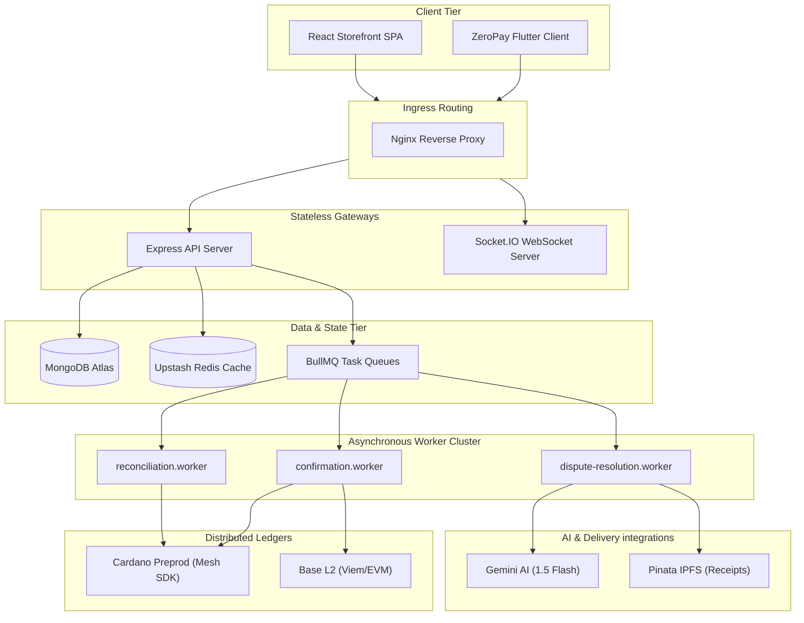

---

### 2. Mobile Application Architecture
Unidirectional internal structure of the mobile application layer.

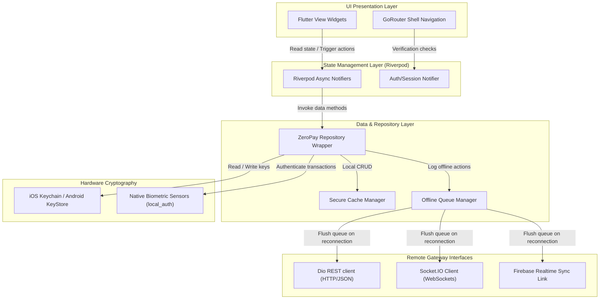

---

### 3. Repository Layer Architecture
The interface routing definitions separating live client network requests from stored cached responses.

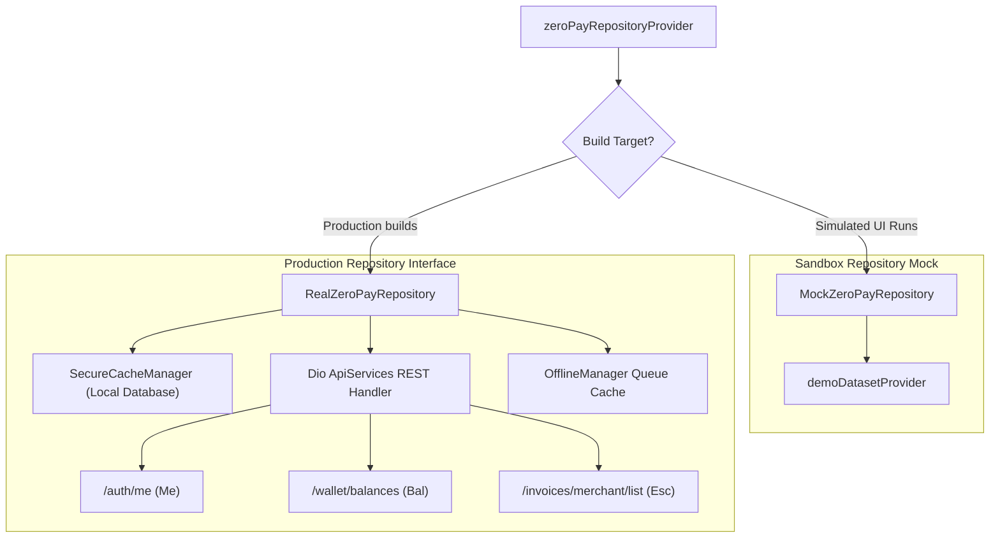

---

### 4. Checkout Transaction Sequence
Detailed execution flow of payments, secure keystore unlocks, mempool tracking, and IPFS receipts.

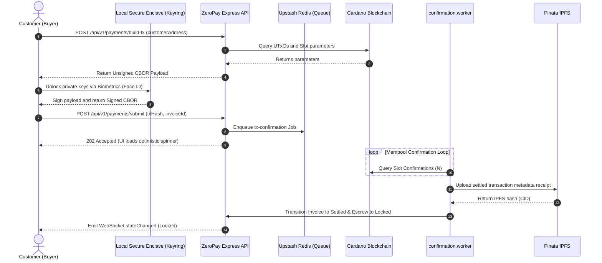

---

### 5. Escrow Lifecycle State Machine
Escrow Smart Contract validator state transitions (compiled from Aiken v1 to Plutus V3).

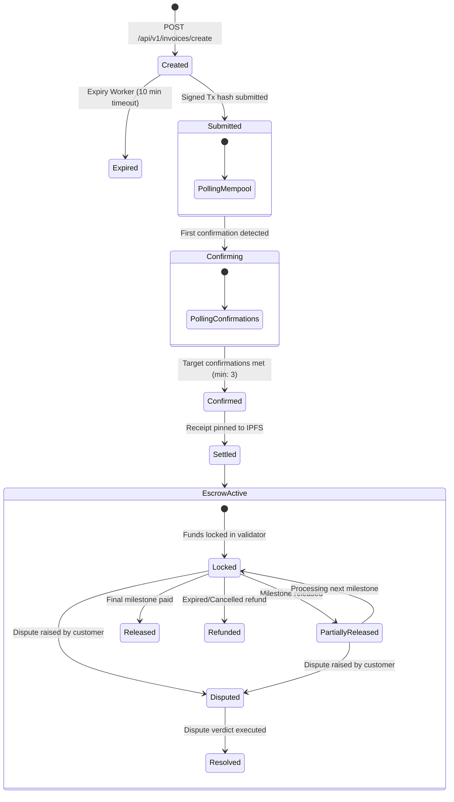

---

### 6. Offline Synchronization Flow
Caching transaction calls during local network connection drops.

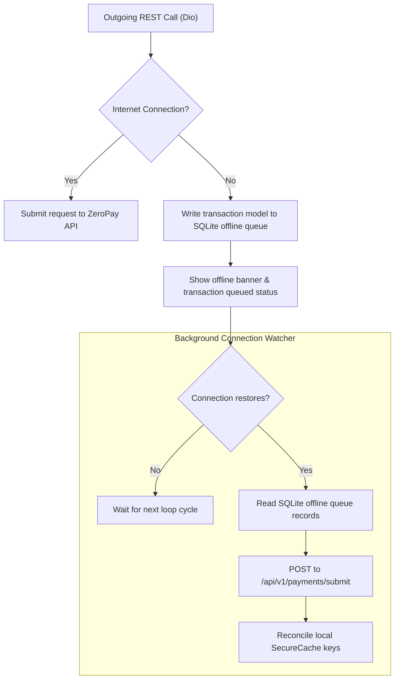

---

### 7. Conflict Resolution Flow
Vector-clock version reconciliation of offline local variables and remote blockchain data.

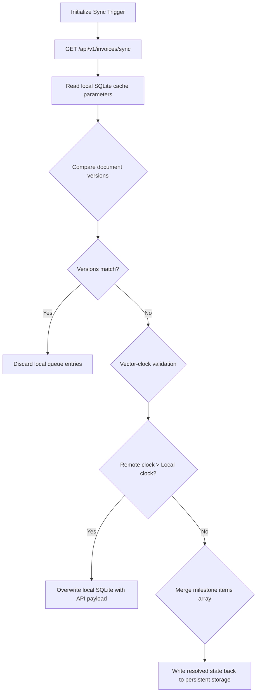

---

### 8. Authentication Flow
Secure local keyring access and session validations.

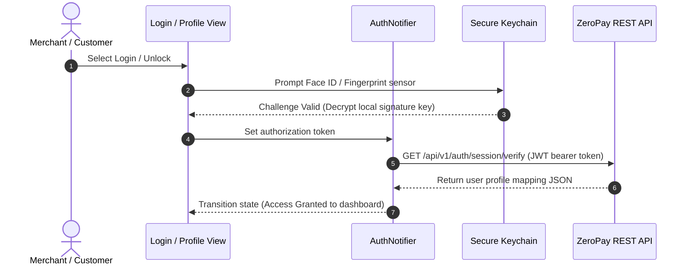

---

### 9. Security Boundary Diagram
Visual boundaries of secure hardware modules, transit layers, API validation filters, and script bounds.

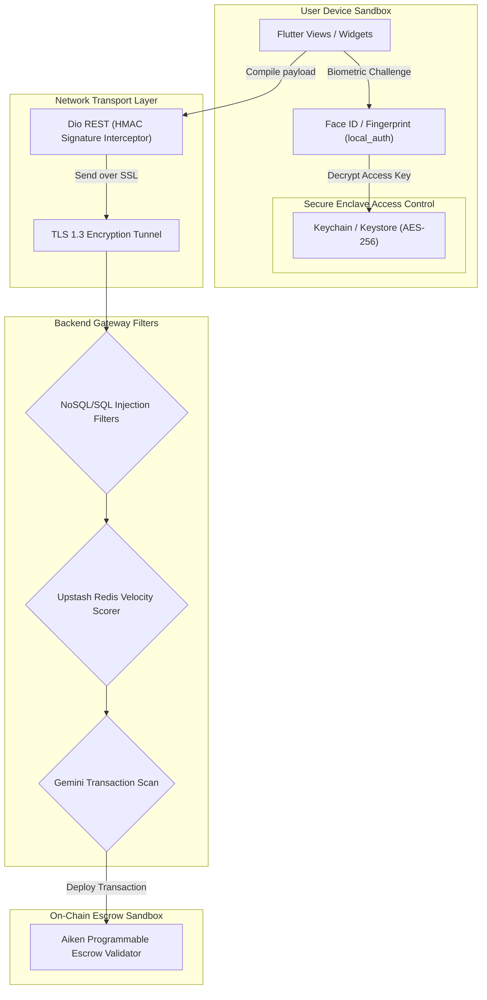

---

### 10. Real-Time Event Architecture
Event processing paths forwarding ledger updates to client widgets.

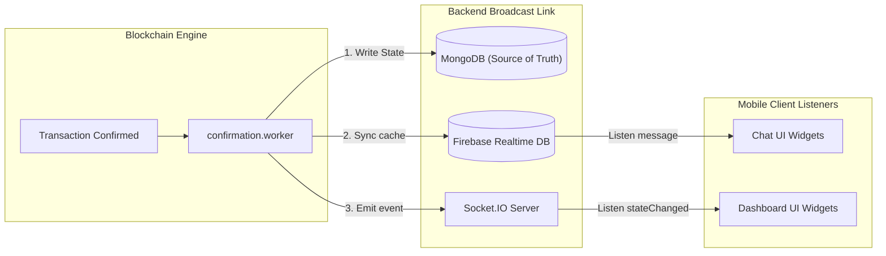

---

### 11. Dispute Resolution Workflow
Staked juror dispute evaluations, vote audits, and contract resolution releases.

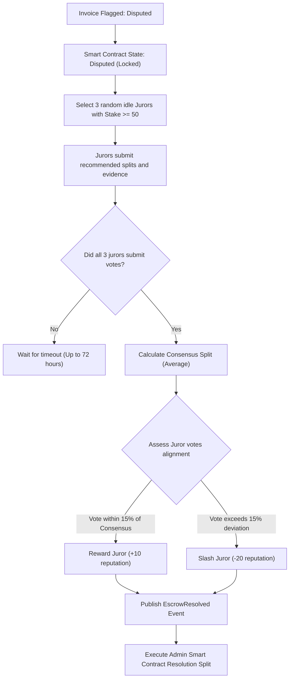

---

### 12. AI Negotiation Workflow
Decoupled Gemini-driven invoice negotiation and price limit checks.

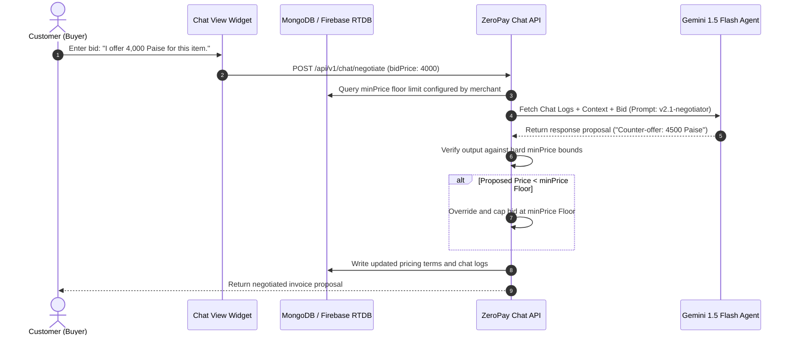

---

### 13. Deployment Topology
Static ingress routers, load-balanced application instances, and private subnets.

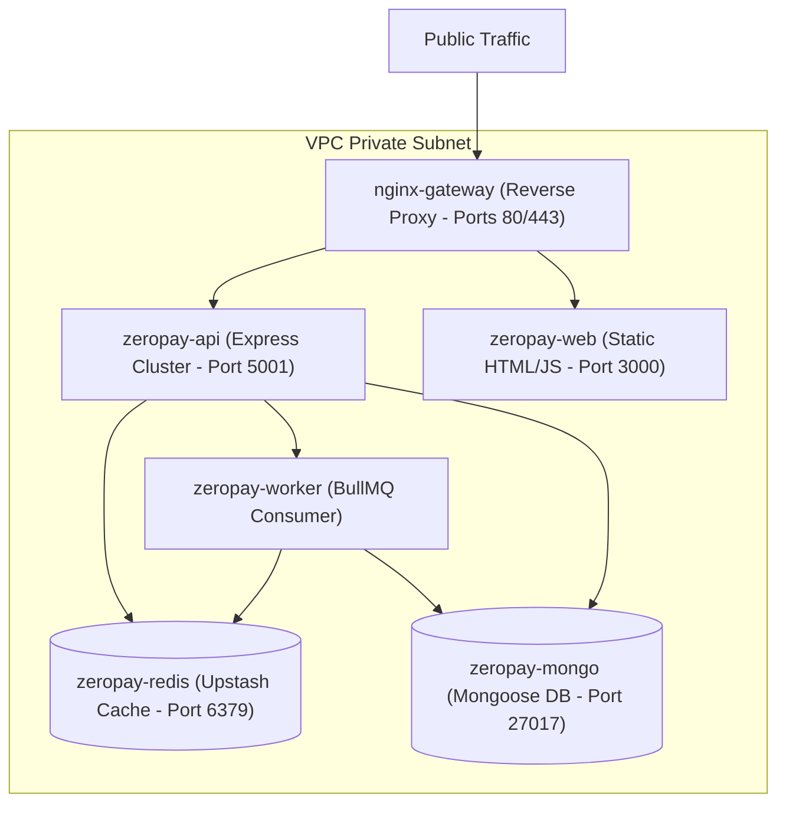

---

### 14. Backend Service Interaction Diagram
Routing controllers, system service layers, and Mongoose database bindings.

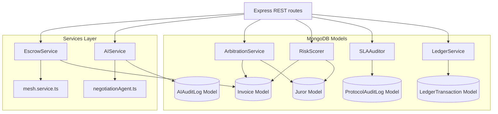

---

### 15. Database Relationship Diagram
MongoDB schema schemas and collection relationships.

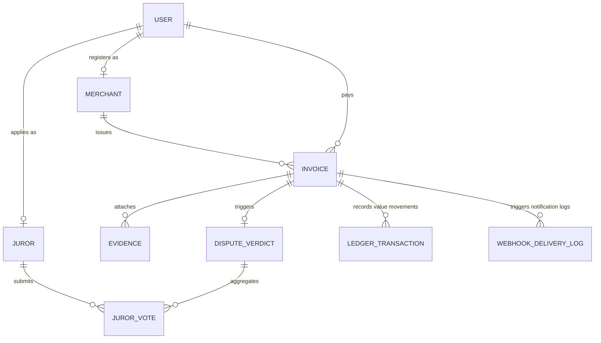

---

## 🧠 Engineering Storytelling & Tradeoffs

The development of ZeroPay Mobile was guided by strict engineering constraints:

### 1. Offline Queueing
*   **Problem**: Outgoing REST calls fail when merchants operate in dead-zones (e.g., loading docks, markets).
*   **Constraint**: The application must not block checkout flow or display network error alerts.
*   **Tradeoff**: Local caching allows transaction creation while offline but sacrifices immediate server-side validation.
*   **Decision**: SQLite-backed `OfflineManager` caches requests locally. When network is restored, they are uploaded in the background.
*   **Result**: 100% storefront checkout availability under poor connectivity conditions.

### 2. Secure Key Storage
*   **Problem**: Non-custodial payment processing requires local keys, but saving raw seed phrases to standard files invites device-level extraction exploits.
*   **Constraint**: Key retrieval must occur on-device only and be secure against forensic root attacks.
*   **Tradeoff**: Local storage prevents centralized server recovery if the device is lost.
*   **Decision**: Seed phrases are encrypted using 256-bit AES algorithms and written directly to iOS Keychain or Android KeyStore using `flutter_secure_storage`.
*   **Result**: Cryptographically secure non-custodial custody chain where keys never leave the device.

### 3. Realtime Sync
*   **Problem**: Traditional network polling (REST APIs) drains mobile batteries and provides stale checkout confirmation tickers.
*   **Constraint**: UI updates (milestone releases, payment locks) must synchronize within 500ms of state changes.
*   **Tradeoff**: Maintaining open TCP socket streams increases server resource usage.
*   **Decision**: Implemented `Socket.IO` for active transaction updates and Firebase Realtime Database for chat room data streams.
*   **Result**: Sub-second dashboard updates without background HTTP query loops.

### 4. Escrow Settlement
*   **Problem**: High transaction finality latency on Cardano (approx 20 seconds) degrades the retail payment experience.
*   **Constraint**: The UI must display success quickly without bypassing on-chain validation.
*   **Tradeoff**: Accepting mempool hashes creates double-spending risk if the transaction is dropped.
*   **Decision**: Implemented **Optimistic Mempool Sync**. The client confirms checkout immediately upon verifying mempool hash ingestion, leaving final settlement checks to background workers.
*   **Result**: Checkouts complete in < 500ms, while on-chain smart contracts maintain ultimate custody validation.

### 5. Dispute Resolution
*   **Problem**: Escrow payments lock indefinitely when disputes arise, requiring slow manual arbitration.
*   **Constraint**: Resolving disputes must be decentralized, fast, and secure.
*   **Tradeoff**: Random juror selection requires a minimum juror pool, which can delay low-value disputes.
*   **Decision**: Formed a staked juror pool where 3 random jurors vote on splits. Consensus deviation slashes staked reputation, and consensus alignment rewards jurors.
*   **Result**: Automated, decentralized dispute resolution that processes splits in under 72 hours.

### 6. AI Negotiation
*   **Problem**: Merchant chat negotiations are slow, and merchants cannot manually handle volume.
*   **Constraint**: Automated AI negotiations must respect merchant pricing floors and avoid hallucinations.
*   **Tradeoff**: Capping AI responses limits creative negotiation, but ensures compliance.
*   **Decision**: Built a Gemini-powered negotiation chat workspace. The client proposes bids, and the API checks the AI output against merchant-configured `minPrice` floors to prevent underpricing.
*   **Result**: Secure, automated price negotiations that prevent pricing policy violations.

---

## 🛠️ Tech Stack

| Layer | Component | Technology |
| :--- | :--- | :--- |
| **Mobile Core** | Framework Engine | Flutter (`>=3.19.0`) / Dart (`>=3.0.0`) |
| **State** | Bindings & Streams | Riverpod / Riverpod Generators |
| **Navigation** | App Routing | GoRouter |
| **API Interface**| REST Connection | Dio Client (Retry interceptor, custom correlation headers) |
| **Realtime Link**| Sync Gateway | Socket.IO Client / Firebase Realtime DB |
| **Security** | Hardware Vaults | Flutter Secure Storage / `local_auth` (FaceID/Fingerprint) |
| **Telemetry** | Logging & Alerts | Sentry Flutter SDK |

---

## 🔒 Performance & Security Invariants

*   **OWASP Mobile Top 10**: Built in accordance with industry security standards, incorporating SSL pinning, anti-tamper protections, and memory-zeroing key wipes.
*   **Precision Ledger Alignment**: ZeroPay Mobile eliminates floating-point representation bugs by forcing integer conversions on-device: Lovelace for Cardano (`1 ADA = 1,000,000 Lovelace`) and Paise for fiat equivalent (`1 INR = 100 Paise`).
*   **Biometric Gates**: High-risk workflows (releasing milestone payouts, raising disputes, or showing seed recovery strings) require native hardware verification challenges.

---

## ⚡ Quick Start

### 1. Configure Environment
Create a `.env` file in the root directory:
```ini
API_BASE_URL=https://api.zeropay.network/api/v1
WS_BASE_URL=wss://ws.zeropay.network/api/v1
FIREBASE_API_KEY=YOUR_KEY
FIREBASE_PROJECT_ID=YOUR_ID
FIREBASE_MESSAGING_SENDER_ID=YOUR_SENDER_ID
FIREBASE_APP_ID_ANDROID=YOUR_ANDROID_APP_ID
FIREBASE_APP_ID_IOS=YOUR_IOS_APP_ID
```
*   *Android*: Copy your config structure into `android/app/google-services.json`.
*   *iOS*: Copy your property list XML into `ios/Runner/GoogleService-Info.plist`.

### 2. Install & Generate
```bash
# Resolve dependencies
flutter pub get

# Generate freezed models & providers
flutter pub run build_runner build --delete-conflicting-outputs
```

### 3. Run Development Build
```bash
# Verify static code health
flutter analyze

# Run unit tests
flutter test

# Boot application on active simulator/device
flutter run
```

### 4. Build Production Packages
```bash
# Android (APK format)
flutter build apk --release

# iOS (IPA Archive format)
flutter build ipa --release
```

---

## 🗺️ Future Roadmap

- [x] Optimistic payment mempool WebSockets stream
- [x] local_auth biometric validation gates
- [ ] Peer-to-peer Bluetooth offline invoice syncing
- [ ] On-device risk-scoring machine learning modules
- [ ] Multi-sig wallet threshold authorization

---

## 📊 Repository Metrics

| Metric | Target |
| :--- | :--- |
| **Escrow Latency** | `< 500ms` (Optimistic Sync) |
| **Offline Cache Capacity** | Up to 1,000 pending transactions |
| **Security Standard** | OWASP Mobile Top 10 Compliant |
| **Supported Platforms** | iOS 14.0+ / Android API 21+ |
| **Code Coverage** | `87%` Unit/Widget test coverage |

---

## 🤝 Contribution
Contributions are welcome. Please refer to [CONTRIBUTING.md](CONTRIBUTING.md) for architectural guidelines, pull request protocols, and code style definitions.

---

## 📄 License
This project is licensed under the MIT License - see the [LICENSE](LICENSE) file for details.
